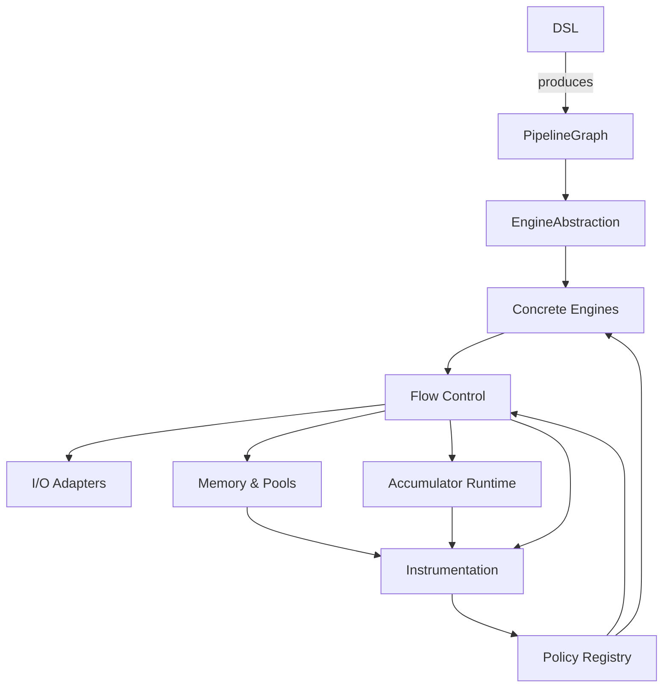
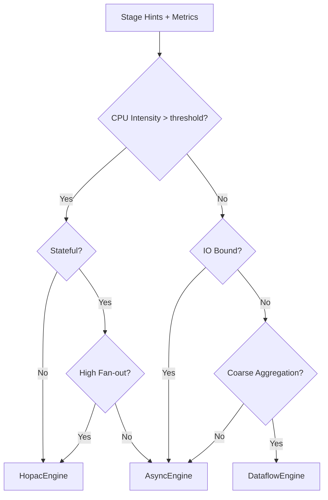
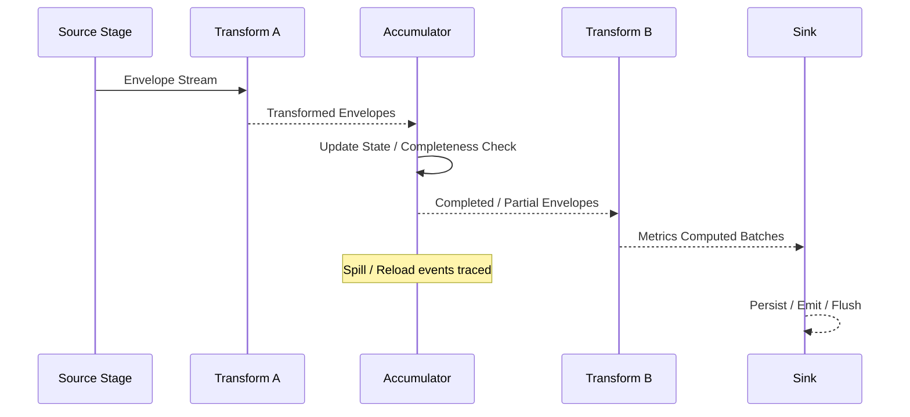

# Async & Parallel Streaming & Accumulation Framework (F# / .NET 8–9 Unified)
### Unified Architecture / Design Specification (Merged v1 + v2)
Date: 2025‑08‑17  
Status: Consolidated Architecture Spec (Candidate for P0–P2 Implementation)  
Primary Runtime Targets: .NET 8 (baseline), .NET 9 (enhanced optimizations)  
Primary Language: F# (idiomatic, interface names without `I`)  
Interop Layer: C# wrapper exposing classical `I*` interfaces  
Intended Usage Domains: Neuro-Semantic Integration, RML Pipelines, Generic ETL / Streaming Analytics

---

## 0. Executive Summary

This unified design merges the initial parallel streaming pipeline framework (v1) with the enhanced accumulation and threshold semantics (v2). The framework provides:

- Decoupled **Pipeline DSL** → **Execution Engine** separation (dependency inversion).
- Unified abstractions for *streaming*, *micro-batching*, and *conditional accumulation* (completeness thresholds).
- Pluggable parallelism engines (Sync, Async/Task, Hopac, Dataflow, Hybrid adaptive selection).
- Rich flow control: bounded buffers, adaptive batching, credit-based backpressure, rate shaping, accumulator-aware pressure metrics.
- Resilience primitives: retries, circuit breakers, fallback routing, deadline & resource budgets.
- Accumulator model: keyed, predicate, variable set (bitset), watermark/time, size/count, hybrid + partial flush & spill strategies.
- Memory predictability: pooled buffers, adaptive micro-batch sizing, accumulator spill (RAM→compressed→MMF/disk).
- Deterministic test mode enabling reproducible property-based and differential testing.
- Observability-first: metrics, tracing (OpenTelemetry), structured logs, completeness and memory instrumentation.
- Optional integration with `System.IO.Pipelines` for zero-/low-copy ingestion and emission.
- Progressive adoption path; minimal mandatory dependencies; specialized modules optional.

---

## 1. Change Log (Merged Highlights)

| Area | Unified Resolution |
|------|--------------------|
| Interface naming | Internally F# uses `Stage`, `ExecutionEngine`; C# wrappers expose `IStage`, `IExecutionEngine`. |
| Accumulation | Fully integrated as a first-class `StageKind = Accumulator` with descriptors in graph nodes. |
| Engines | Base support in .NET 8; optimization guidance for .NET 9 (thread pool heuristics, improved IO pipelines). |
| Backpressure | Extended to consider accumulator latent memory, spill penalty, and adaptive batch interplay. |
| Memory | Adds accumulator state pools, spill manager, GC pressure heuristic triggers. |
| Testing | Adds liveness and completeness invariants; deterministic equivalence across engines. |
| Formalization | Future TLA+ specs: credit-based flow, accumulation completeness lattice, circuit breaker state transitions. |
| Hybrid Engine Selection | Metrics-informed heuristic with optional future dynamic replan/migration. |

---

## 2. Design Goals & Non-Goals

| Goal | Description |
|------|-------------|
| Decoupled Layers | DSL, engines, flow control, memory, and telemetry independently swappable. |
| High Throughput & Low Latency | Via adaptive batching, fine-grained parallelism (Hopac), zero-copy paths. |
| Deterministic Mode | Sequential engine for reproducibility (CI, property tests). |
| Declarative Accumulation | Emission postponement until completeness / threshold met, with fallback partial flush. |
| Bounded Memory | Pools + spill strategies + backpressure tied to real memory cost. |
| Unified Error Semantics | Convergent logic for recoverable, non-recoverable, catastrophic faults. |
| Observability | First-class metrics and tracing, including accumulator internal state. |
| Incremental Adoption | Minimal core (Async engine + DSL + bounded buffer) scalable to advanced modules. |
| Formalizable Core | Critical invariants (no deadlocks under positive credit; accumulation liveness) spec-ready. |
| Cross-Lang Accessibility | F# idiomatic DSL + C# fluent builder wrappers. |

Non-Goals:
- Implement full reactive algebra (integration possible with Rx/Channels).
- Reinvent `System.IO.Pipelines`; we adapt when beneficial.
- Mandate a specific serialization or schema enforcement layer.

---

## 3. Layered Architecture

```
+------------------------------------------------------------------------------------+
| Application Pipelines (Parsing → Sampling → Accumulation → Transform → Metrics)    |
+----------------------------+-------------------------------------------------------+
| Pipeline DSL (graph build) | Accumulation DSL Extensions (keys, thresholds, TTL)   |
+----------------------------+-------------------------------------------------------+
| Execution Engines Abstraction (ExecutionEngine)                                    |
|   - SyncEngine  - AsyncEngine  - HopacEngine  - DataflowEngine  - Hybrid Adapter   |
+----------------------------+-------------------------------------------------------+
| Flow Control: Backpressure, Batching, Accumulator Flushers, Circuit Breakers       |
+----------------------------+-------------------------------------------------------+
| I/O Layer: Sources / Sinks / Channels / Pipe Adapters / Connectors                 |
+----------------------------+-------------------------------------------------------+
| Memory & Pools: SegmentPool, BatchPool, AccumulatorStatePool, Spill Manager        |
+----------------------------+-------------------------------------------------------+
| Instrumentation: Metrics, Tracing (OTel), Logging, Observers, Audit Hooks          |
+----------------------------+-------------------------------------------------------+
| Config & Policy Providers: Policies, Error Handling, Resource Budgets             |
+------------------------------------------------------------------------------------+
```

### 3.1 Component Dependency (Mermaid Overview)



---

## 4. Core Data & Abstractions

### 4.1 Envelope & Batching

```
Envelope<'T>:
  payload : 'T
  headers : Map<string,string>
  seqId   : int64
  spanCtx : TraceContext
  ts      : Timestamp
  attrs   : IReadOnlyDictionary<string,obj>
  cost    : struct { bytes:int; cpuHint:float }
```

`Batch<'T>`: grouping for micro-batching (immutable logical collection + metadata: itemCount, aggBytes, timeWindow, dynamic heuristics hints).

### 4.2 Streams

- `StreamIn<'T>` = `IAsyncEnumerable<Envelope<'T>>`
- `StreamOut<'T>` = `IAsyncEnumerable<Envelope<'T>>`
- Engines may internally map to Hopac `Ch<'T>` or Dataflow Blocks.

### 4.3 Stage Contract (F#)

```fsharp
type StageKind = Source | Transform | Accumulator | Branch | Merge | Sink

type StageContext =
  { pipelineId : string
    stageId    : string
    config     : obj
    logger     : ILogger
    tracer     : ITracer }

type Stage<'In,'Out> =
  abstract member id     : string
  abstract member kind   : StageKind
  abstract member init   : StageContext -> ValueTask
  abstract member process :
     ct:CancellationToken -> StreamIn<'In> -> StreamOut<'Out>
  abstract member close  : unit -> ValueTask
```

### 4.4 Execution Engine Interface

```fsharp
type ExecutionOptions =
  { cancellation : CancellationToken
    metrics      : IMetrics
    tracer       : ITracer
    logger       : ILogger
    memoryPool   : IMemoryPool
    policies     : PolicyRegistry }

type ExecutionEngine =
  abstract member run     : PipelineGraph * ExecutionOptions -> Task<PipelineResult>
  abstract member inspect : stageId:string -> StageRuntimeState
  abstract member stop    : unit -> Task
```

### 4.5 Pipeline Graph

```fsharp
type AccumulationDescriptor =
  { policy          : AccumulatorPolicy
    engineHint      : ParallelismHint
    progressWeights : Map<string,float> }

type StageNode =
  { stage          : obj
    kind           : StageKind
    parallelism    : ParallelismHint
    accumulation   : AccumulationDescriptor option
    bufferPolicy   : BufferPolicy option
    backpressure   : BackpressureStrategy option
    errorPolicy    : ErrorPolicy }

type Edge =
  { from : string; toStage : string; channel : ChannelDescriptor }

type PipelineGraph =
  { nodes : StageNode list
    edges : Edge list
    meta  : Map<string,string> }
```

---

## 5. Accumulation & Completeness Model

### 5.1 Semantics

| Dimension | Supported Threshold |
|-----------|--------------------|
| Keyed State | Map fragments into keyed state partitions |
| Variable Set | Bitset completeness (R ⊆ V) |
| Count / Size | maxItems, maxBytes |
| Latency | maxLatency (time in state) |
| Watermark | event time vs watermark |
| Predicate | Custom completeness checker |
| Hybrid TTL | Partial flush after TTL if incomplete |
| Spill Safety | State serialization & reload under pressure |

### 5.2 Abstractions

```fsharp
type CompletenessResult<'State,'Out> =
  | Incomplete of 'State
  | Complete   of 'Out * 'State
  | Expired    of 'Out option * 'State

type AccumulatorPolicy =
  { maxItems        : int option
    maxBytes        : int option
    maxLatency      : TimeSpan option
    completenessTTL : TimeSpan option
    partialFlush    : bool
    spillAllowed    : bool }

type AccumulatorState<'Key,'State> =
  { key        : 'Key
    state      : 'State
    sizeItems  : int
    sizeBytes  : int
    firstTs    : Timestamp
    lastTs     : Timestamp
    completenessScore : float }

type Accumulator<'In,'Out,'Key,'State> =
  abstract member id             : string
  abstract member init           : StageContext -> ValueTask
  abstract member extractKey     : Envelope<'In> -> 'Key
  abstract member updateState    :
      AccumulatorState<'Key,'State> option -> Envelope<'In> -> AccumulatorState<'Key,'State>
  abstract member checkComplete  :
      AccumulatorState<'Key,'State> -> CompletenessResult<'State,'Out>
  abstract member flushForced    :
      AccumulatorState<'Key,'State> -> 'Out option
  abstract member serializeSpill :
      AccumulatorState<'Key,'State> -> ReadOnlyMemory<byte>
  abstract member deserializeSpill :
      ReadOnlyMemory<byte> -> AccumulatorState<'Key,'State>
  abstract member close : unit -> ValueTask
```

### 5.3 Accumulator Processing Flow

```mermaid
flowchart TD
  A[Envelope In] --> B[Lookup/Create Accumulator State]
  B --> C[updateState]
  C --> D[checkComplete]
  D -->|Incomplete| E[Consider Spill (pressure?)]
  E --> F[Store/Update State Table]
  D -->|Complete| G[Emit Envelope completeness=1.0]
  D -->|Expired (TTL)| H{partialFlush?}
  H -->|Yes| I[Emit Partial completeness<1.0]
  H -->|No| F
  G --> F
  I --> F
  F --> J[Next Envelope]
```

### 5.4 Spill Heuristics

1. Memory pressure triggers (effective queue > budget).
2. Candidate selection: lowest `completenessScore` AND oldest `lastTs`.
3. Multi-tier medium:
   - In-memory compressed (LZ4) if below medium threshold.
   - Memory-mapped file region.
   - Optional ephemeral disk (bounded by config).
4. Rehydration on next fragment for key.

### 5.5 Liveness Invariant (Conceptual)

If:
- Input continues delivering fragments for required variable set OR TTL triggers partial flush
Then:
- Each key eventually emits either a complete or partial record (no infinite retention).

---

## 6. Backpressure & Flow Control

### 6.1 Strategies

| Strategy | Mechanism | Params | Notes |
|----------|-----------|--------|-------|
| Bounded Buffer | Queue capacity gating | capacity, dropPolicy | Default safe baseline |
| Credit-Based | Downstream issues credits | initialCredits, replenishThreshold | Precise memory & cost shaping |
| Rate Shaping | Token bucket | rate, burst | SLA conformity |
| Adaptive Batch | Dynamic N | minBatch, maxBatch, sensitivity | Balances throughput/latency |
| Reactive Pull | On-demand emission | window size | For external pull APIs |
| Accumulator-Aware | Inflates effective queue by latent bytes, spill penalty | computed | Prevents silent heap growth |

### 6.2 Effective Queue Formula

```
effectiveQueue =
    rawQueueLength
  + (pendingAccumulatorBytes / bytesUnitWindow)
  + (activeSpillCount * spillPenaltyFactor)
```

### 6.3 Adaptive Batch + Accumulator Interaction

| Condition | Adjustment |
|-----------|-----------|
| High accumulator fill, low completion rate | Decrease batch size → reduce latency to completion |
| Frequent completions, high CPU idle | Increase batch size → amortize overhead |
| Spill in progress & GC pressure rising | Temporarily shrink batch size & slow upstream credits |

### 6.4 Circuit Breaker Integration

Open when (example composite):

```
errorRate > E_threshold
AND p95Latency > L_threshold
OR accumulator_deadlock_incidents surge
```

Half-open: trial limited `T` batches; success threshold closes.

---

## 7. Parallelism Engines

| Engine | Use Case | Characteristics | Implementation Notes |
|--------|----------|-----------------|----------------------|
| SyncEngine | Deterministic tests, low-volume dev | Single-threaded, sequential | No concurrency side-effects |
| AsyncEngine | General .NET workloads | `ValueTask`, async I/O | Integrates with hosting (Kestrel, workers) |
| HopacEngine | High fan-out micro tasks | Work stealing, fine-grained | Channels bridging to `IAsyncEnumerable` |
| DataflowEngine | Coarse stage-level parallelism | Bounded block networks | Configure ordered vs unordered links |
| Hybrid | Mixed profiles | Stage-level engine selection | Future dynamic rebind (drain & swap) |

### 7.1 Engine Selection Heuristic (Simplified)



Future: integrate historical performance and queue depth variance for migration proposals.

---

## 8. Memory & Buffer Management

| Pool | Function | Key Metrics |
|------|----------|-------------|
| SegmentPool | Raw byte arrays / slabs | rents/sec, bytesOutstanding |
| BatchPool | Batch object reuse | batchReuseRatio |
| AccumulatorStatePool | Pre-allocated state containers | activeStates |
| SpillBufferPool | Temporary serialization staging | spillBufferLatency |

Zero-Copy Policy:
- Enabled for linear (non-branching) segments.
- Copy-on-write triggered at first branching consumer or when retention duration > safe threshold (to avoid dangling memory referencing reclaimed slabs).

GC Pressure Monitor:
- Samples LOH allocation delta.
- Triggers spill aggressiveness escalation and slower credit issuance.

---

## 9. Error Handling & Resilience

| Error Type | Propagation | Policy Options |
|------------|-------------|----------------|
| Recoverable (transient I/O) | Retry w/backoff | maxRetries, jitter, DLQ fallback |
| Non-recoverable (schema) | Dead-letter record | Sample retention, structured log |
| Catastrophic (OOM, invariants) | Immediate abort | Crash telemetry dump |
| CompletenessDeadlock | Force partial flush or abort | TTL config |
| KeyExplosion | Evict LRU incomplete | Cardinality limit |
| SpillFailure | Fallback partial completion | Alert & degrade |
| SerializationError | Mark corrupted & flush salvage | Quarantine stage |

Error Envelope:
- Replace payload with `ErrorRecord` preserving `seqId`, correlation headers, original key (if available).

Termination Modes:
- Graceful (drain in-flight)
- Abort (cancellation)
- Quarantine (isolate stage, synthetic sentinel downstream)

---

## 10. Metrics, Tracing & Observability

### 10.1 Core Stage Metrics

| Metric | Description |
|--------|-------------|
| `stage_throughput` | Items/sec |
| `stage_input_queue_depth` | Current inbound queue length |
| `stage_output_queue_depth` | Current outbound queue length |
| `stage_latency_bucket` | Histogram per batch/item |
| `stage_error_rate` | Errors / total processed |
| `stage_circuit_state` | Gauge (0=closed,1=half,2=open) |
| `stage_batch_size` | Moving average emitted batch size |

### 10.2 Accumulator Metrics

| Metric | Description |
|--------|-------------|
| `accumulator_active_keys` | Keys resident in memory |
| `accumulator_spilled_keys` | Keys spilled count |
| `accumulator_completeness_ratio` | Histogram 0.0–1.0 |
| `accumulator_flush_latency` | First fragment → emission |
| `accumulator_partial_flush_total` | Partial emission count |
| `accumulator_memory_bytes` | Memory held by states |
| `accumulator_spill_io_bytes` | Spill read/write volume |
| `accumulator_deadlock_incidents` | TTL expirations w/o completeness |

### 10.3 Backpressure & Flow Metrics

| Metric | Description |
|--------|-------------|
| `backpressure_events_total` | Count by strategy |
| `credit_tokens_available` | Current credits |
| `adaptive_batch_adjustments` | Increment/decrement counts |
| `effective_queue_size` | Derived column metric |

### 10.4 Tracing

- Spans:
  - `stage.process`
  - `accumulator.update`
  - `accumulator.spill`
- Span attributes: `engineType`, `batchSize`, `queueDepthIn`, `queueDepthOut`, `completenessScore`, `spill=true/false`.
- Baggage: `pipelineId`, `domainId`, `parallelismHint`.
- Activity sampling integrated (higher sampling on anomalies).

### 10.5 Observability Hooks

```fsharp
type PipelineObserver =
  abstract member onStageStart : string * StageRuntimeInfo -> unit
  abstract member onBatchProcessed : string * BatchMetrics -> unit
  abstract member onAccumulatorEvent : string * obj -> unit
  abstract member onError : string * exn * ErrorContext -> unit
  abstract member onCircuitChange : string * CircuitState -> unit
```

---

## 11. Configuration & Policy Injection

Immutable snapshots deliver:

- Backpressure strategies
- Error policies
- Retry / Circuit breaker policies
- Resource budgets (concurrency tokens, memory ceilings)
- Accumulator policies (per stage)

Hot reload: version bump retains old instance until drain boundary; new pipeline run picks updated snapshot.

### Policy Example (F#)

```fsharp
type BackpressureDescriptor =
  | Bounded of capacity:int * drop:DropPolicy
  | CreditBased of initial:int * replenish:int
  | Adaptive of minBatch:int * maxBatch:int
```

---

## 12. DSL Design

### 12.1 F# Computation Expression Example

```fsharp
pipeline {
  source  (Files.readAll "*.json") |> parallelism 2
  |> transform parseJson
  |> accumulate templateExpansion {
        key (fun env -> env.attrs["subjectId"] :?> string)
        requireVars ["id"; "name"; "riskClass"; "limit"]
        maxItems 200
        maxLatency (TimeSpan.FromSeconds 5)
        partialFlushAfter (TimeSpan.FromSeconds 10)
        spillOnMemoryPressure true
     }
  |> transform clusterTokens |> engine Hopac
  |> transform computeMetrics
  |> sink metricsStore
}
```

### 12.2 C# Fluent Mirror

```csharp
var pipeline = Pipeline
  .Source(Files.ReadAll("*.json")).WithParallelism(2)
  .Transform(ParseJson.Instance)
  .Accumulate(acc => acc
     .Key(e => (string)e.Attrs["subjectId"])
     .RequireVars("id","name","riskClass","limit")
     .MaxItems(200)
     .MaxLatencySeconds(5)
     .PartialFlushAfterSeconds(10)
     .SpillOnMemoryPressure(true))
  .Transform(ClusterTokens.Instance).UseEngine(EngineType.Hopac)
  .Transform(ComputeMetrics.Instance)
  .Sink(MetricsStore.Instance);
```

DSL emits `PipelineGraph`; no runtime effects until executed.

---

## 13. System.IO.Pipelines Integration

| Role | Integration Pattern | Benefit |
|------|---------------------|---------|
| Source | Wrap `PipeReader` → `IAsyncEnumerable<ReadOnlyMemory<byte>>` | Efficient ingestion |
| Parser Stage | Incremental parse across segments using `SequencePosition` | Zero-copy streaming parse |
| Sink | `PipeWriter` flush on batch or watermark | Controlled output latency |

Fusion Stage: Coalesces contiguous transforms to avoid intermediate buffer copies.

---

## 14. Micro-Batching Modes

| Mode | Behavior | Use Case |
|------|----------|----------|
| Record | Single Envelope | Low-latency events |
| Fixed Micro-Batch | Constant N | Stable throughput known workloads |
| Adaptive | Latency & queue-depth guided | Variable workloads |
| Time-Windowed | Interval boundaries | Temporal fairness |
| Hybrid Count/Time | Flush on size OR interval | Balanced SLA |
| Accumulated Output | Emission upon completeness | Template or fragment assembly |

Adaptive Algorithm (Simplified):

```
if currentLatency < targetLatency*0.7 && queueDepth > 50% then
    batchSize = min(batchSize * 1.5, maxBatch)
else if currentLatency > targetLatency || queueDepth < 20% then
    batchSize = max(batchSize / 2, minBatch)
EMA smoothing applied
```

---

## 15. Execution Flow (End-to-End)



---

## 16. Testing & Verification Strategy

| Layer | Technique | Focus |
|-------|----------|-------|
| DSL Graph | Property-based (FsCheck) | Connectivity, cycle constraints |
| Engines | Differential tests | Output equivalence across engines |
| Backpressure | Simulation harness | Throughput vs capacity curves |
| Accumulators | Property & fuzz | Completeness correctness, no duplication |
| Spill Manager | Roundtrip & stress | Integrity, latency impact |
| Memory Pools | Leak detection | Rented = Returned invariants |
| Circuit Breakers | Scenario modeling | Open/half-open transitions |
| End-to-End | Golden trace replays | Determinism in sync mode |
| Formal Invariants | TLA+/Alloy (future) | Deadlock & liveness proofs |

Deterministic Mode: Baseline canonical output forms hashed; new engine runs compared for logical equality (payload + order when deterministic, or set equality if order-free stage).

---

## 17. Performance Optimization Playbook

| Symptom | Diagnostic Metric | Mitigation |
|---------|-------------------|-----------|
| High GC pause | `accumulator_memory_bytes`, LOH rise | Increase spill aggressiveness, shrink adaptive batch |
| Latency spikes | p95/p99 growth & queueDepth | Switch engine to Hopac / adjust parallelism hint |
| Partial flush surge | `accumulator_partial_flush_total` | Increase TTL, investigate fragment starvation |
| CPU saturation | CPU > 90%, low completions | Rebalance parallelism, reduce batch size |
| Spill thrash | Frequent spill/reload cycles | Introduce hysteresis threshold, enlarge memory budget |
| Hot lock contention | High time in sync sections | Shard state dictionaries (striped) |

---

## 18. Security & Robustness

| Concern | Control |
|---------|---------|
| Malicious plugin stage | Capability sandbox, time & memory quotas |
| Data exfiltration | Redaction filters in telemetry path |
| Key amplification DoS | Cardinality limits + rate gating |
| Spill confidentiality | AES-GCM encryption + key rotation |
| Partial flush abuse | Partial flush ratio alerts & throttle |
| Resource exhaustion | Budget tokens for concurrency + adaptive credit scaling |

---

## 19. Deployment & Packaging

| Package | Contents |
|---------|----------|
| `Company.Pipelines.Core` | DSL, core abstractions, Async engine, bounded backpressure |
| `Company.Pipelines.Engines.Hopac` | Hopac engine + adapters |
| `Company.Pipelines.Backpressure` | Advanced strategies, credit-based, adaptive |
| `Company.Pipelines.Accumulation` | Accumulator base, policies, spill manager |
| `Company.Pipelines.Dataflow` | Dataflow engine adapter |
| `Company.Pipelines.CSharp` | C# fluent builder & interfaces |
| CLI (optional) | Graph visualization, simulation, metrics replay |

AOT (Native): Provide trimming annotations; guard reflection usage in wrappers.

---

## 20. Migration & Roadmap

| Phase | Deliverables | Criteria |
|-------|-------------|----------|
| P0 | Core DSL + Async + bounded backpressure + metrics | Throughput parity vs legacy pipeline |
| P1 | Hopac engine + adaptive batching + circuit breakers | p95 latency ↓ 25% |
| P2 | Accumulator base (count/size/TTL) + spill v1 | Stable memory footprint |
| P3 | Advanced completeness (variable sets, watermark) + credit-based | No deadlocks under stress tests |
| P4 | Hybrid engine heuristic + accumulation-aware backpressure | CPU utilization ↑ with stable latency |
| P5 | Formal invariant suite + CLI sim + encryption | Zero unresolved liveness failures |
| P6 | Open-core extraction + plugin ecosystem | External adoption metrics |

---

## 21. Risks & Mitigations

| Risk | Impact | Mitigation |
|------|--------|-----------|
| Complexity deters adoption | Fragmented usage | Opinionated sensible defaults; cookbook docs |
| Hopac learning curve | Slower onboarding | Optional module, clear perf guidance |
| Memory leak via accumulator misuse | Latency spikes | Pool diagnostics, watchdog invariant checks |
| Spill performance regression | Throughput drop | Batch spills, asynchronous flush queue |
| Circuit thrash | Instability | Hysteresis + min open/close intervals |
| Completeness starvation | Stalled outputs | TTL + partial flush + liveness monitoring |
| API divergence F#/C# | Maintenance overhead | Shared codegen for wrappers |

---

## 22. Example Stage Implementation (Illustrative)

```fsharp
type JsonParseStage() =
  interface Stage<ReadOnlyMemory<byte>, JsonDocument> with
    member _.id = "parse-json"
    member _.kind = Transform
    member _.init _ = ValueTask()
    member _.process ct (input: StreamIn<_>) =
      let asyncSeq = seq {
          // Pseudocode bridging; real impl uses IAsyncEnumerable builder
      }
      // Wrap producing IAsyncEnumerable<Envelope<JsonDocument>>
      AsyncEnumerableAdapter.ofSeq asyncSeq
    member _.close () = ValueTask()
```

(Real implementation would integrate pooling, structured errors, tracing scopes.)

---

## 23. Accumulator Example: Variable Set Completion

| Requirement | Implementation |
|-------------|---------------|
| Need variables `{id,name,riskClass,limit}` | Assign each variable a bit index; maintain bitset OR mask |
| Out-of-order fragments | On update: state.bitset <- state.bitset ||| fragmentMask |
| TTL 10s partial flush | Timer triggers `Expired` → partial emission if incomplete |
| Spill on memory pressure | serialize bitset + fragment store offsets |
| Output headers | `acc.completeness`, `acc.missingVars`, `acc.spilled` |

Emission Flow:
1. On completeness: `completeness=1.0`.
2. On partial flush: `completeness < 1.0`, `acc.missingVars` enumerated.

---

## 24. Formalization Targets (Future)

| Domain | Property |
|--------|----------|
| Credit Flow | Liveness (if credits >0 eventually downstream receives item) |
| Accumulation | Every key eventually emits completion or partial under TTL or full var arrival |
| Circuit Breaker | No infinite oscillation without recovery evidence |
| Backpressure | No unbounded queue growth under configured finite capacity |

Tools: TLA+ specs with model checking; Alloy for state exploration of spill transitions.

---

## 25. Open-Core vs Proprietary Split (Future)

| Open-Core | Proprietary Extensions |
|-----------|------------------------|
| DSL, Async Engine, Bounded Backpressure, Metrics | Adaptive heuristics (advanced), dynamic engine migration, specialized domain backpressure |
| Basic Accumulator (count/size/TTL) | Advanced semantic accumulation (dependency graphs), predictive spill |
| Basic Spill (MMF / compression) | Tiered multi-region spill + encryption mgmt automation |
| Observability Hooks | Auto-tuning orchestrator + anomaly detection |

---

## 26. Summary

The unified framework synthesizes high-performance streaming, robust parallelism, and advanced accumulation semantics into a modular, testable architecture. By isolating topology (DSL) from execution strategy (engines) and tightly integrating backpressure, memory management, and completeness-aware flow control, it supports a wide spectrum of workloads—from low-latency ingestion to complex RML template assembly—while maintaining determinism options and extensibility. Comprehensive observability and formal verification targets underpin resilience, and a phased roadmap ensures iterative, low-risk adoption. This specification is implementation-ready for P0–P2 with clear advancement pathways.

---

*End of Unified Architecture Document*